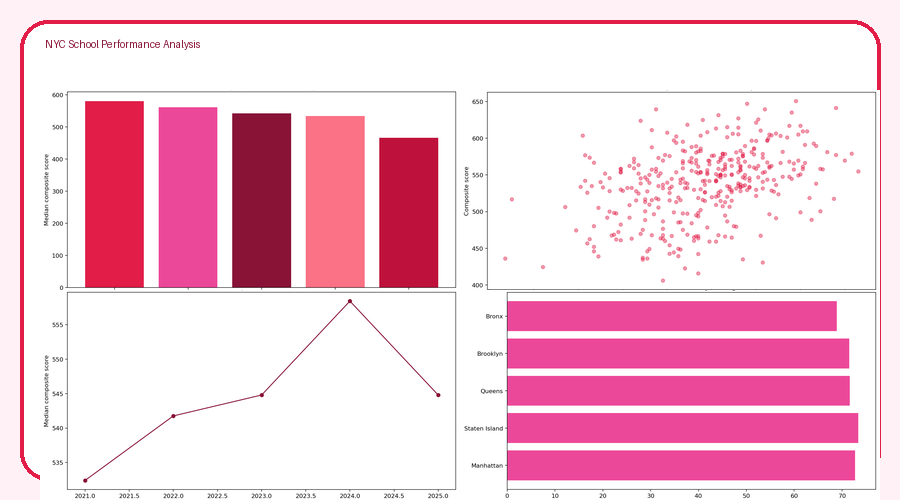
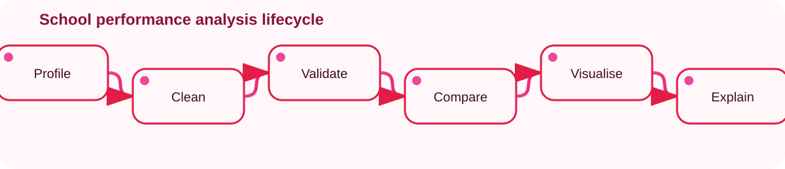

<div align="center">

[](#)
[](#)
[](#)
[](https://fowziafaria1234-ops.github.io/nyc-school-performance-analysis/dashboard/)
</div>

## 🏫 Project overview

A recruiter-ready reconstruction of Faria's school-performance project. The analysis profiles and cleans more than 350 school-year records, compares performance across boroughs, flags outliers and translates findings into an accessible MI summary.

> **Transparency:** School names and records are synthetic. The repository reproduces the analytical methods described in the original training project without presenting fabricated public-school results as official statistics.



## 🔎 Key demonstration findings

- **Manhattan** ranks highest on median composite performance: **580.4**
- **Bronx** ranks lowest: **466.6**
- Attendance and composite performance correlation: **0.39**
- Required-field completeness improved from **96.1%** to **100.0%** after cleansing

## 🧭 Workflow



## 🛠️ Methods demonstrated

- Type conversion and missing-value treatment
- Duplicate removal and completeness checks
- Borough/year median imputation
- IQR-based outlier flags
- Composite metric design
- Grouped summaries and ranked MI reporting
- Visual storytelling for non-technical readers

## ▶️ Reproduce the project

```bash
pip install -r requirements.txt
python src/run_pipeline.py
pytest -q
```

Open `dashboard/index.html` for the animated browser dashboard.

## 📚 Supporting material

- [Jupyter notebook](./notebooks/NYC_School_Performance_Analysis.ipynb)
- [Management information report](./docs/MI_REPORT.md)
- [Data dictionary](./DATA_DICTIONARY.md)

---
<div align="center">Made with 🌹 by <a href="https://github.com/fowziafaria1234-ops">Faria Islam</a></div>
